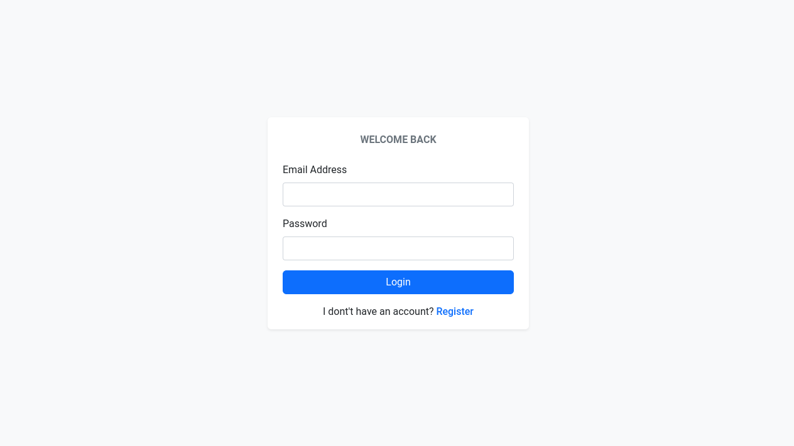
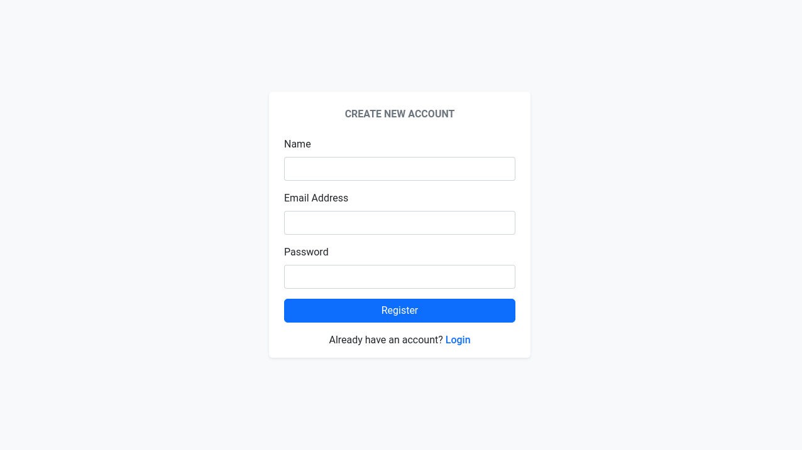
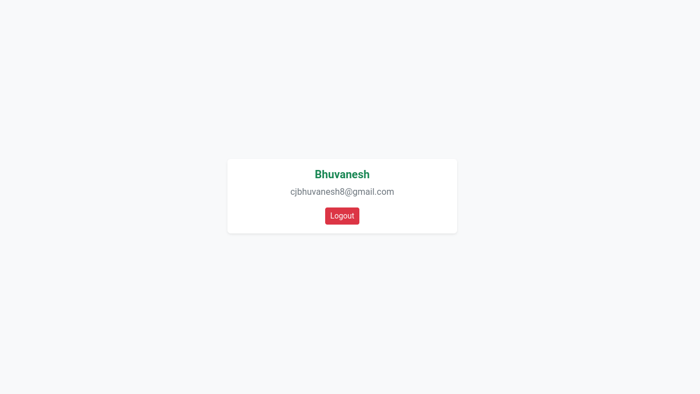

# Laravel 10 Custom Registration and Login

This repository provides an example of a custom registration and login system implemented in Laravel 10.

## Getting Started

### 1. Create a new project

```
composer create-project laravel/laravel custom-login
```

### 2. Set up your database credentials

Update the .env file in your project root with your database details:

```
DB_CONNECTION=mysql
DB_HOST=127.0.0.1
DB_PORT=3306
DB_DATABASE=your_database_name
DB_USERNAME=your_username
DB_PASSWORD=your_password
```

### 3. Install Yoeunes toastr package

```
composer require yoeunes/toastr
```

### 4. Migrate your database tables

```
php artisan migrate
```

### 5. Create an Auth Controller

```
php artisan make:controller AuthController
```

app/Http/Controllers/AuthController.php

```
<?php

namespace App\Http\Controllers;

use App\Models\User;
use Illuminate\Http\Request;
use Illuminate\Support\Facades\Auth;

class AuthController extends Controller
{
    public function loginIndex()
    {
        return view('login');
    }

    public function registerIndex()
    {
        return view('register');
    }

    public function login(Request $request)
    {
        $this->validate($request, [
            'email' => 'required|email',
            'password' => 'required|min:8',
        ]);

        $credentials = $request->only('email', 'password');

        if (Auth::attempt($credentials)) {
            return redirect('/');
        }

        toastr()->error('Invalid email or password');
        return redirect('login');
    }

    public function register(Request $request)
    {
        $this->validate($request, [
            'name' => 'required',
            'email' => 'required|email|unique:users',
            'password' => 'required|min:8',
        ]);

        $user = new User();
        $user->name = $request->name;
        $user->email = $request->email;
        $user->password = \Hash::make($request->password);
        $user->save();

        Auth::login($user);
        toastr()->success('Registration successful!');
        return redirect('/');
    }

    public function logout()
    {
        Auth::logout();
        toastr()->success('Logout successful!');
        return redirect('login');
    }
}
```

### 6. Create a Welcome Controller

```
php artisan make:controller WelcomeController
```

app/Http/Controllers/WelcomeController.php

```
<?php

namespace App\Http\Controllers;

class WelcomeController extends Controller
{
    public function index()
    {
        return view('welcome');
    }
}
```

### 7. Modify web.php routes file

routes/web.php

```
<?php

use App\Http\Controllers\AuthController;
use App\Http\Controllers\WelcomeController;
use Illuminate\Support\Facades\Route;

/*
|--------------------------------------------------------------------------
| Web Routes
|--------------------------------------------------------------------------
|
| Here is where you can register web routes for your application. These
| routes are loaded by the RouteServiceProvider and all of them will
| be assigned to the "web" middleware group. Make something great!
|
 */

Route::middleware('guest')->group(function () {
    Route::get('login', [AuthController::class, 'loginIndex']);
    Route::get('register', [AuthController::class, 'registerIndex']);

    Route::post('login', [AuthController::class, 'login']);
    Route::post('register', [AuthController::class, 'register']);
});

Route::middleware('auth')->group(function () {
    Route::get('/', [WelcomeController::class, 'index']);
    Route::get('logout', [AuthController::class, 'logout']);
});
```

### 8. Modify Auth Middleware

app/Middleware/Authenticate.php

```
<?php

namespace App\Http\Middleware;

use Illuminate\Auth\Middleware\Authenticate as Middleware;
use Illuminate\Http\Request;

class Authenticate extends Middleware
{
    /**
     * Get the path the user should be redirected to when they are not authenticated.
     */
    protected function redirectTo(Request $request): ?string
    {
        return $request->expectsJson() ? null : url('login');
    }
}
```

### 9. Modify Guest Middleware

app/Middleware/RedirectIfAuthenticated.php

```
<?php

namespace App\Http\Middleware;

use Closure;
use Illuminate\Http\Request;
use Illuminate\Support\Facades\Auth;
use Symfony\Component\HttpFoundation\Response;

class RedirectIfAuthenticated
{
    /**
     * Handle an incoming request.
     *
     * @param  \Closure(\Illuminate\Http\Request): (\Symfony\Component\HttpFoundation\Response)  $next
     */
    public function handle(Request $request, Closure $next, string...$guards): Response
    {
        $guards = empty($guards) ? [null] : $guards;

        foreach ($guards as $guard) {
            if (Auth::guard($guard)->check()) {
                return redirect('/');
            }
        }

        return $next($request);
    }
}
```

### 10. Create Resources

resources/views/layouts/app.blade.php

```
<!DOCTYPE html>
<html lang="en">

<head>
    <meta charset="UTF-8">
    <meta name="viewport" content="width=device-width, initial-scale=1.0">
    <title>@yield('title') | {{env('APP_NAME')}}</title>

    <link rel="stylesheet" href="https://cdn.jsdelivr.net/npm/bootstrap@5.3.2/dist/css/bootstrap.min.css"
        integrity="sha384-T3c6CoIi6uLrA9TneNEoa7RxnatzjcDSCmG1MXxSR1GAsXEV/Dwwykc2MPK8M2HN" crossorigin="anonymous">
</head>

<body>

    @yield('content')

    <script src="https://cdn.jsdelivr.net/npm/bootstrap@5.3.2/dist/js/bootstrap.bundle.min.js"
        integrity="sha384-C6RzsynM9kWDrMNeT87bh95OGNyZPhcTNXj1NW7RuBCsyN/o0jlpcV8Qyq46cDfL"
        crossorigin="anonymous"></script>
</body>

</html>
```

resources/views/login.blade.php

```
@extends('layouts.app')
@section('title', 'Login')
@section('content')

<section class="bg-body-tertiary">
    <div class="d-flex justify-content-center align-items-center min-vh-100">
        <div class="container">
            <div class="row justify-content-center">
                <div class="col-md-4">
                    <div class="card border-0 shadow-sm py-3 px-4">
                        <div class="text-center py-2 mb-3">
                            <p class="mb-0 text-uppercase fw-bold text-secondary">
                                Welcome Back
                            </p>
                        </div>
                        <form class="row gy-3" action="{{url('login')}}" method="post">
                            @csrf
                            <div class="col-12">
                                <label for="emailInp" class="form-label">Email Address</label>
                                <input type="email" class="form-control" id="emailInp" name="email"
                                    value="{{old('email')}}">
                                @error('email')<small class="text-danger">{{$message}}</small>@enderror
                            </div>
                            <div class="col-12">
                                <label for="passInp" class="form-label">Password</label>
                                <input type="password" class="form-control" id="passInp" name="password">
                                @error('password')<small class="text-danger">{{$message}}</small>@enderror
                            </div>
                            <div class="col-12">
                                <button class="btn btn-primary w-100" type="submit">Login</button>
                            </div>
                        </form>
                        <div class="mt-3 text-center">
                            <p class="mb-0">
                                I dont't have an account?
                                <a class="fw-medium" href="{{url('register')}}">
                                    Register
                                </a>
                            </p>
                        </div>
                    </div>
                </div>
            </div>
        </div>
    </div>
</section>

@endsection
```

resources/views/register.blade.php

```
@extends('layouts.app')
@section('title', 'Register')
@section('content')

<section class="bg-body-tertiary">
    <div class="d-flex justify-content-center align-items-center min-vh-100">
        <div class="container">
            <div class="row justify-content-center">
                <div class="col-md-4">
                    <div class="card border-0 shadow-sm py-3 px-4">
                        <div class="text-center py-2 mb-3">
                            <p class="mb-0 text-uppercase fw-bold text-secondary">
                                Create new account
                            </p>
                        </div>
                        <form class="row gy-3" action="{{url('register')}}" method="post">
                            @csrf
                            <div class="col-12">
                                <label for="nameInp" class="form-label">Name</label>
                                <input type="text" class="form-control" id="nameInp" name="name"
                                    value="{{old('name')}}">
                                @error('name')<small class="text-danger">{{$message}}</small>@enderror
                            </div>
                            <div class="col-12">
                                <label for="emailInp" class="form-label">Email Address</label>
                                <input type="email" class="form-control" id="emailInp" name="email"
                                    value="{{old('email')}}">
                                @error('email')<small class="text-danger">{{$message}}</small>@enderror
                            </div>
                            <div class="col-12">
                                <label for="passInp" class="form-label">Password</label>
                                <input type="password" class="form-control" id="passInp" name="password">
                                @error('password')<small class="text-danger">{{$message}}</small>@enderror
                            </div>
                            <div class="col-12">
                                <button class="btn btn-primary w-100" type="submit">Register</button>
                            </div>
                        </form>
                        <div class="mt-3 text-center">
                            <p class="mb-0">
                                Already have an account?
                                <a class="fw-medium" href="{{url('login')}}">
                                    Login
                                </a>
                            </p>
                        </div>
                    </div>
                </div>
            </div>
        </div>
    </div>
</section>

@endsection
```

resources/views/welcome.blade.php

```
@extends('layouts.app')
@section('title', 'Welcome')
@section('content')

<section class="bg-body-tertiary">
    <div class="d-flex justify-content-center align-items-center min-vh-100">
        <div class="container">
            <div class="row justify-content-center">
                <div class="col-md-4">
                    <div class="card shadow-sm border-0 p-3">
                        <div class="text-center">
                            <h5 class="text-success fw-semibold">
                                {{auth()->user()->name}}
                            </h5>
                            <p class="text-secondary">
                                {{auth()->user()->email}}
                            </p>
                            <a class="btn btn-sm btn-danger" href="{{url('logout')}}">
                                Logout
                            </a>
                        </div>
                    </div>
                </div>
            </div>
        </div>
    </div>
</section>

@endsection
```

### 11. Adding Custom CSS (Optional)

public/css/main.css

```
@import url("https://fonts.googleapis.com/css2?family=Roboto:ital,wght@0,100;0,300;0,400;0,500;0,700;0,900;1,100;1,300;1,400;1,500;1,700;1,900&display=swap");

/*--------------------------------------------------------------
# General
--------------------------------------------------------------*/
:root {
    scroll-behavior: smooth;
}

body {
    font-family: "Roboto", sans-serif;
}

a {
    cursor: pointer;
    text-decoration: none;
}

a:hover,
a:focus {
    text-decoration: none;
}

input:-webkit-autofill,
input:-webkit-autofill:hover,
input:-webkit-autofill:focus,
input:-webkit-autofill:active {
    transition: background-color 5000s ease-in-out 0s;
}

textarea {
    resize: none;
}

hr {
    margin: 10px 0px;
    color: darkgray;
}

::-moz-selection {
    color: #ffffff;
    background: var(--bs-primary);
}

::selection {
    color: #ffffff;
    background: var(--bs-primary);
}

::-webkit-scrollbar {
    width: 5px;
    height: 8px;
    background-color: #fff;
}

::-webkit-scrollbar-thumb {
    background-color: #aab7cf;
}

/*--------------------------------------------------------------
# Override some default Bootstrap stylings
--------------------------------------------------------------*/
*:focus {
    box-shadow: none !important;
    outline: 0px !important;
}

.form-control,
.form-select {
    border-radius: 4px;
    border: 1px solid #ced4da;
}

.form-control:focus,
.form-select:focus {
    background-color: #fdfdfd;
    border: 1.5px solid var(--bs-primary);
    outline: 0;
    box-shadow: 0 0 0.25rem 0.05rem rgba(105, 108, 255, 0.1);
}
```

resources/views/layouts/app.blade.php

> Add the below line inside your head tag

```
<link rel="stylesheet" href="{{asset('css/main.css')}}">
```

### 12. Run your project

```
php artisan serve
```

## Screenshot


<br>

<br>

